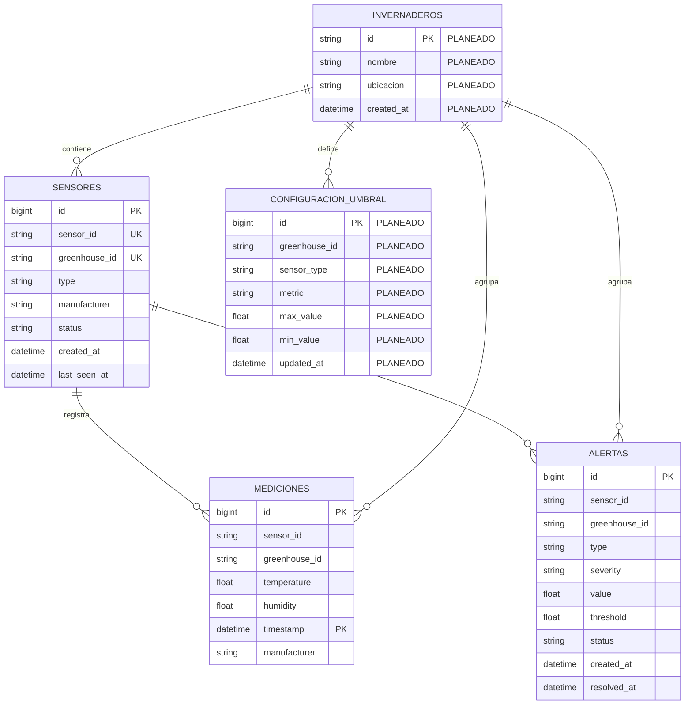

# Diagrama Relacional de Base de Datos

Este mapa representa el modelo actual y la extension planeada para configuracion de umbrales. En local `mediciones` se crea como hypertable de TimescaleDB. En Supabase remoto funciona como tabla PostgreSQL normal si TimescaleDB no esta disponible.

## Tablas Implementadas

### `mediciones`

Guarda las series de tiempo recibidas desde RabbitMQ.

| Campo | Tipo | Nota |
|---|---|---|
| `id` | BIGSERIAL | Parte de PK local junto con `timestamp` |
| `sensor_id` | TEXT | Sensor de origen |
| `greenhouse_id` | TEXT | Invernadero/sector |
| `temperature` | DOUBLE PRECISION | Temperatura |
| `humidity` | DOUBLE PRECISION | Humedad |
| `timestamp` | TIMESTAMPTZ | Tiempo de lectura |
| `manufacturer` | TEXT | Fabricante/adaptador |

Indices:

- `idx_greenhouse_sensor`
- `idx_greenhouse_timestamp`

### `sensores`

Inventario persistente de sensores.

| Campo | Tipo | Nota |
|---|---|---|
| `id` | BIGSERIAL | PK |
| `sensor_id` | TEXT | Identificador del sensor |
| `greenhouse_id` | TEXT | Invernadero/sector |
| `type` | TEXT | Tipo logico, default `TELEMETRY` |
| `manufacturer` | TEXT | Fabricante |
| `status` | TEXT | Default `ACTIVE` |
| `created_at` | TIMESTAMPTZ | Fecha de alta |
| `last_seen_at` | TIMESTAMPTZ | Ultimo evento visto |

Restriccion:

- `UNIQUE (greenhouse_id, sensor_id)`

### `alertas`

Alertas persistentes generadas por `AlarmService`.

| Campo | Tipo | Nota |
|---|---|---|
| `id` | BIGSERIAL | PK |
| `sensor_id` | TEXT | Sensor que genero alerta |
| `greenhouse_id` | TEXT | Invernadero/sector |
| `type` | TEXT | Ej. `CRITICAL_TEMPERATURE` |
| `severity` | TEXT | Ej. `HIGH` |
| `value` | DOUBLE PRECISION | Valor detectado |
| `threshold` | DOUBLE PRECISION | Umbral usado |
| `status` | TEXT | `ACTIVE` / futuro `RESOLVED` |
| `created_at` | TIMESTAMPTZ | Fecha alerta |
| `resolved_at` | TIMESTAMPTZ | Futuro al resolver |

Indices:

- `idx_alertas_status_created`
- `idx_alertas_sensor_type`

## Tablas Planeadas

### `invernaderos`

Formaliza los sectores/invernaderos. Actualmente `greenhouse_id` se maneja como texto directo.

### `configuracion_umbral`

Permite que `AlarmService` use umbrales configurables en vez del valor fijo de 35 C.

