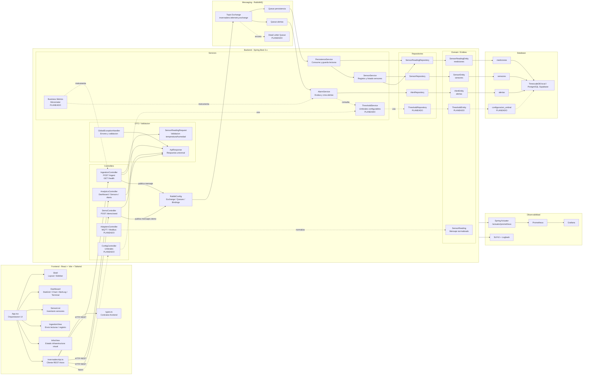

# Diagrama de Componentes Actualizado

Este diagrama representa los componentes reales del proyecto y las piezas planeadas para alinearlo mejor con el diagrama original sin sobreingenieria.

## Estado de Componentes

| Componente | Estado |
|---|---|
| Frontend dashboard | Implementado |
| Cliente REST frontend | Implementado |
| IngestionController HTTP | Implementado |
| Validacion DTO | Implementado |
| RabbitMQ exchange/queues | Implementado |
| PersistenceService | Implementado |
| AlarmService | Implementado |
| Sensores persistentes | Implementado |
| Alertas persistentes | Implementado |
| Demo seed endpoint | Implementado |
| Metricas tecnicas Actuator | Parcial |
| Metricas de negocio | Planeado |
| Resolver alertas | Planeado |
| Umbrales configurables | Planeado |
| Adapters MQTT/Modbus simulados | Planeado |
| DLQ RabbitMQ | Planeado |

