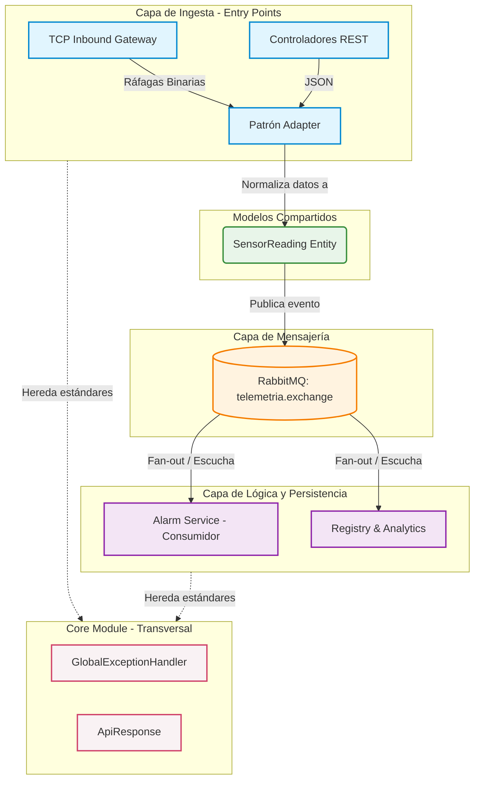

# 🌿 Sistema Invernadero IoT Monitor

## 📝 Descripción del Proyecto
Sistema IoT distribuido para el monitoreo ambiental de invernaderos. Captura y procesa datos de temperatura y humedad en tiempo real para prevenir la pérdida de cultivos mediante alertas tempranas y análisis de datos. 

Este proyecto no es un CRUD monolítico tradicional, sino un **sistema distribuido orientado a eventos (Event-Driven)** diseñado para soportar entornos industriales, manejar ráfagas de telemetría y escalar de manera horizontal.

---

## 🚀 Funciones Principales
* **Recepción Multimarca:** Patrón *Adapter* que normaliza diferentes tramas binarias TCP de múltiples fabricantes de sensores (Bosch, Honeywell, etc.).
* **Gestión de Sensores:** Registro y administración centralizada de los dispositivos de telemetría.
* **Alertas en Tiempo Real:** Consumidores reactivos que disparan notificaciones automáticas (email/móvil) al superar umbrales críticos de temperatura o humedad.
* **Reportes y Analítica:** Almacenamiento en series de tiempo para consultas históricas y exposición de datos (API REST) para herramientas de Inteligencia de Negocios (BI) o modelos de IA.

---

## 🏗️ Arquitectura del Sistema (Domain-Centric)

El sistema separa la lógica por **Capacidades de Negocio**, asegurando que cada módulo funcione de manera independiente y asíncrona.

### 1. Desglose por Capas
* **Capa de Ingesta (Entry Points):** Soporta tanto HTTP (REST) para controladores modernos como TCP Directo (Puerto 9000) para Gateways industriales. El sistema no sabe qué marca es el sensor; un `SensorAdapter` traduce los bytes a un modelo `SensorReading` común.
* **Capa de Mensajería (The Decoupler):** Utiliza **RabbitMQ** como tejido conector. La ingesta solo "publica y olvida", permitiendo soportar miles de lecturas por segundo sin bloquear el servidor.
* **Capa de Lógica Reactiva (Alarm Service):** Escucha la cola de telemetría y evalúa umbrales. Si un parámetro sale del rango seguro, dispara la lógica de notificación de forma asíncrona.
* **Capa de Persistencia e Inteligencia (Registry & Analytics):** Guarda las métricas en bases de datos de series de tiempo (ej. PostgreSQL/TimescaleDB) y expone la información para herramientas de análisis sin interferir con el flujo de entrada de datos.

### 2. Diagrama de Componentes (Estructura Lógica)
Flujo de datos desde la ingesta hacia los consumidores finales a través del Message Broker.



### 3. Diagrama de Despliegue (Infraestructura)
Topología de red y despliegue físico del sistema industrial.

```mermaid
graph LR
    classDef hardware fill:#eceff1,stroke:#546e7a,stroke-width:2px;
    classDef cloud fill:#e3f2fd,stroke:#1565c0,stroke-width:2px;
    classDef database fill:#e8f5e9,stroke:#2e7d32,stroke-width:2px;
    classDef client fill:#fff8e1,stroke:#ffb300,stroke-width:2px;

    subgraph NodoEdge [Invernadero]
        Sensors((Sensores Físicos)):::hardware
        Gateway[Industrial Gateway]:::hardware
        Sensors -->|Señales| Gateway
    end

    subgraph AppServer [Servidor Backend]
        Backend("Docker - Spring Boot"):::cloud
    end

    Gateway -->|TCP Pto 9000 sobre VPN| Backend

    subgraph Middleware [Middleware]
        RabbitMQ[(RabbitMQ)]:::cloud
    end

    Backend -->|AMQP| RabbitMQ
    RabbitMQ -->|Eventos| Backend

    subgraph DataNode [Nodo de Datos]
        DB[(PostgreSQL)]:::database
    end

    Backend -->|Persistencia| DB

    subgraph ClientLayer [Capa Cliente]
        BI[Dashboards / BI]:::client
        Mobile[Apps Móviles]:::client
    end

    BI -->|HTTPS API REST| Backend
    Mobile -->|HTTPS API REST| Backend
