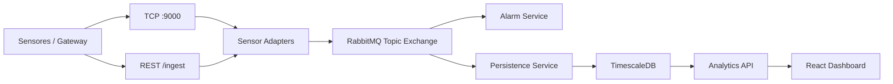

<div align="center">
  
</div>

# Sistema Invernadero

Sistema distribuido para monitoreo de sensores en invernaderos, orientado a telemetria IoT, procesamiento asincrono, persistencia de series de tiempo y visualizacion operativa en un dashboard web.

El proyecto combina un frontend en React/Vite con un backend Java Spring Boot. La arquitectura usa RabbitMQ como broker de mensajes y TimescaleDB/PostgreSQL como base de datos optimizada para lecturas historicas de sensores.

> Estado actual: el frontend y el backend compilan correctamente, pero el flujo completo end-to-end aun debe validarse levantando toda la infraestructura, enviando telemetria simulada y confirmando persistencia/lectura desde el dashboard.

## Tabla de contenido

- [Vision general](#vision-general)
- [Arquitectura](#arquitectura)
- [Flujo de datos](#flujo-de-datos)
- [Stack tecnologico](#stack-tecnologico)
- [Estructura del repositorio](#estructura-del-repositorio)
- [Modulos principales](#modulos-principales)
- [Puertos y servicios](#puertos-y-servicios)
- [Requisitos](#requisitos)
- [Ejecucion local](#ejecucion-local)
- [Endpoints principales](#endpoints-principales)
- [Formato de telemetria](#formato-de-telemetria)
- [Verificaciones realizadas](#verificaciones-realizadas)
- [Estado funcional real](#estado-funcional-real)
- [Pendientes y roadmap](#pendientes-y-roadmap)
- [Documentacion adicional](#documentacion-adicional)
- [Contexto para futuras sesiones](#contexto-para-futuras-sesiones)

## Vision general

El objetivo del sistema es recibir lecturas de sensores de diferentes fabricantes, normalizarlas a un modelo comun, distribuirlas a servicios especializados y exponer informacion util para operadores del invernadero.

Casos de uso principales:

- Recepcion de telemetria desde gateways o sensores.
- Normalizacion de payloads mediante el patron Adapter.
- Distribucion asincrona de eventos con RabbitMQ.
- Deteccion de alertas por temperatura critica.
- Persistencia de lecturas en TimescaleDB.
- Consulta de datos agregados para dashboards.
- Visualizacion de temperatura, humedad y KPIs operativos.

## Arquitectura

El backend sigue una organizacion modular por feature:

```text
com.sistemas.invernadero
|-- config
|   `-- RabbitConfig
|-- core
|   |-- exceptions
|   `-- responses
|-- shared
|   `-- model
`-- modules
    |-- alarm
    |-- analytics
    |-- ingestion
    |-- persistence
    `-- registry
```

La arquitectura esta pensada para separar responsabilidades:

- `ingestion`: recibe datos por HTTP o TCP y aplica adapters por fabricante.
- `alarm`: consume eventos y evalua umbrales criticos.
- `persistence`: consume eventos y guarda lecturas en TimescaleDB.
- `analytics`: expone datos agregados para el dashboard.
- `registry`: punto inicial para registro/reportes de sensores.
- `core`: respuestas API y manejo global de excepciones.

Vista logica:



## Flujo de datos

1. Un sensor o gateway envia una lectura.
2. El backend identifica el fabricante.
3. Un `SensorAdapter` transforma el payload a `SensorReading`.
4. El evento se publica en RabbitMQ con routing key:

```text
invernadero.[GREENHOUSE_ID].[SENSOR_ID]
```

5. RabbitMQ entrega el mensaje a las colas:

```text
alarm.queue
persistence.queue
```

6. `AlarmService` evalua si la temperatura supera el umbral.
7. `PersistenceService` guarda la lectura en `mediciones`.
8. `AnalyticsController` consulta las lecturas recientes.
9. El dashboard consume `/api/v1/analytics/dashboard/{greenhouseId}`.

## Stack tecnologico

### Frontend

- React 19
- TypeScript
- Vite
- Tailwind CSS
- Recharts
- Lucide React
- Motion
- Axios

### Backend

- Java 17
- Spring Boot 3.2.2
- Spring Web
- Spring AMQP
- Spring Data JPA
- Spring Integration IP
- PostgreSQL Driver
- Lombok

### Infraestructura

- Docker
- Docker Compose
- RabbitMQ Management
- TimescaleDB sobre PostgreSQL 15
- Kubernetes manifest base
  - Manifiestos completos en `k8s/`
  - Frontend productivo servido con Nginx y proxy `/api`

## Estructura del repositorio

```text
.
|-- src/
|   |-- components/
|   |   `-- Dashboard.tsx
|   |-- services/
|   |   `-- analyticsService.ts
|   |-- App.tsx
|   |-- constants.ts
|   |-- index.css
|   |-- main.tsx
|   `-- types.ts
|-- java-backend/
|   |-- src/main/java/com/sistemas/invernadero/
|   |   |-- config/
|   |   |-- core/
|   |   |-- modules/
|   |   `-- shared/
|   |-- src/main/resources/
|   |   |-- application.properties
|   |   `-- schema.sql
|   |-- Dockerfile
|   |-- docker-compose.yml
|   `-- pom.xml
|-- K8S_MANIFEST.yml
|-- k8s/
|   |-- DEPLOYMENT.md
|   |-- backend.yaml
|   |-- frontend.yaml
|   |-- postgres.yaml
|   |-- rabbitmq.yaml
|   `-- autoscaling.yaml
|-- Dockerfile
|-- nginx.conf
|-- SESSION_CONTEXT.md
|-- DOCUMENTACION_ARQUITECTURA.md
|-- CONFIGURACION_TOTAL.md
|-- RUN_LOCAL.md
|-- INFRA_STANDARDS.md
|-- AGENTS.md
|-- AGENT_TASKS.md
|-- PROJECT_SKILLS.md
`-- README.md
```

## Modulos principales

### Ingestion

Ubicacion:

```text
java-backend/src/main/java/com/sistemas/invernadero/modules/ingestion
```

Responsabilidades:

- Recibir payloads de sensores.
- Seleccionar adapter por fabricante.
- Normalizar datos a `SensorReading`.
- Publicar lecturas en RabbitMQ.

Adapters disponibles:

- `BoschSensorAdapter`: interpreta payload binario.
- `HoneywellSensorAdapter`: interpreta JSON enviado como bytes.

### Messaging

Configuracion:

```text
java-backend/src/main/java/com/sistemas/invernadero/config/RabbitConfig.java
```

Contratos principales:

```text
Exchange: invernadero.telemetry.exchange
Tipo: Topic
Routing pattern: invernadero.#
Alarm queue: alarm.queue
Persistence queue: persistence.queue
```

### Persistence

Ubicacion:

```text
java-backend/src/main/java/com/sistemas/invernadero/modules/persistence
```

Responsabilidades:

- Consumir eventos desde `persistence.queue`.
- Mapear `SensorReading` a `SensorReadingEntity`.
- Guardar lecturas en la tabla `mediciones`.

La tabla se define en:

```text
java-backend/src/main/resources/schema.sql
```

El esquema usa `create_hypertable` para convertir `mediciones` en una hypertable de TimescaleDB.

### Alarm

Ubicacion:

```text
java-backend/src/main/java/com/sistemas/invernadero/modules/alarm
```

Responsabilidades:

- Consumir lecturas desde `alarm.queue`.
- Evaluar umbral de temperatura.
- Emitir logs de alerta critica cuando se supera el limite.

Umbral actual:

```text
MAX_TEMP = 35.0
```

### Analytics

Ubicacion:

```text
java-backend/src/main/java/com/sistemas/invernadero/modules/analytics
```

Responsabilidades:

- Consultar lecturas recientes por invernadero.
- Calcular temperatura promedio de las ultimas 24 horas.
- Exponer datos para el dashboard.

### Dashboard

Ubicacion:

```text
src/components/Dashboard.tsx
```

Responsabilidades:

- Mostrar KPIs operativos.
- Graficar temperatura y humedad.
- Consultar `analyticsService`.
- Usar fallback mock cuando el backend no esta disponible.

KPIs actuales:

- Temperatura promedio real desde backend cuando existe data.
- Alertas activas: mock temporal.
- Sensores operando: mock temporal.

## Puertos y servicios

| Servicio | Puerto | Descripcion |
| --- | ---: | --- |
| Frontend Vite | 3000 | Dashboard React |
| Backend Spring Boot | 8080 | API REST |
| TCP ingestion | 9000 | Entrada TCP para gateways/sensores |
| RabbitMQ AMQP | 5672 | Broker de mensajes |
| RabbitMQ Management | 15672 | UI administrativa |
| TimescaleDB/PostgreSQL | 5432 | Base de datos |

## Requisitos

- Node.js LTS
- npm
- Docker Desktop
- Java 17
- Maven, opcional si se compila fuera de Docker

Notas de entorno conocidas:

- En PowerShell puede fallar `npm` por politicas de ejecucion. Usar `npm.cmd`.
- El proyecto no incluye Maven Wrapper todavia.
- Si `mvn` no esta disponible localmente, usar Docker para compilar el backend.

## Ejecucion local

### 1. Instalar dependencias frontend

Desde la raiz del proyecto:

```powershell
npm.cmd install
```

### 2. Levantar infraestructura

Desde `java-backend`:

```powershell
cd java-backend
docker-compose up -d
```

Esto levanta:

- RabbitMQ
- TimescaleDB
- Backend Java, si se usa el servicio `app` incluido en Compose

### 3. Ejecutar frontend

Desde la raiz del proyecto:

```powershell
npm.cmd run dev
```

Abrir:

```text
http://localhost:3000
```

### 4. Acceder a RabbitMQ

Abrir:

```text
http://localhost:15672
```

Credenciales por defecto:

```text
usuario: guest
password: guest
```

## Build y verificacion

### Frontend lint

```powershell
npm.cmd run lint
```

### Frontend build

```powershell
npm.cmd run build
```

Nota: actualmente puede aparecer una advertencia no bloqueante por bundle mayor a 500 kB, esperable por dependencias como Recharts.

### Backend build con Docker

Desde `java-backend`:

```powershell
docker build -t sistema-invernadero-backend:verify .
```

### Frontend build con Docker

Desde la raiz del proyecto:

```powershell
docker build -t sistema-invernadero-frontend:verify .
```

## Endpoints principales

### Analytics dashboard

```http
GET /api/v1/analytics/dashboard/{greenhouseId}
```

Ejemplo:

```http
GET http://localhost:8080/api/v1/analytics/dashboard/GW-001
```

Respuesta esperada:

```json
{
  "success": true,
  "message": "Datos de analitica recuperados correctamente",
  "data": {
    "recentReadings": [],
    "averageTemperature24h": 0.0,
    "period": "LAST_24H"
  }
}
```

### Ingestion REST

```http
POST /ingest/{greenhouseId}
Header: X-Manufacturer: BOSCH | HONEYWELL
Body: bytes del payload
```

### Sensor registry

```http
POST /sensors/register?greenhouseId={id}&sensorId={id}
GET /sensors/report/{greenhouseId}
```

## Formato de telemetria

Modelo canonico usado internamente:

```json
{
  "sensorId": "S01",
  "greenhouseId": "GW-001",
  "temperature": 28.5,
  "humidity": 65.0,
  "manufacturer": "BOSCH",
  "timestamp": "2026-05-14T10:00:00"
}
```

Routing key generada:

```text
invernadero.GW-001.S01
```

## Base de datos

Tabla principal:

```text
mediciones
```

Campos principales:

- `id`
- `sensor_id`
- `greenhouse_id`
- `temperature`
- `humidity`
- `timestamp`
- `manufacturer`

Optimizaciones previstas:

- Hypertable por `timestamp`.
- Indice por `greenhouse_id`, `sensor_id`, `timestamp DESC`.

## Verificaciones realizadas

Ultimas verificaciones registradas:

```text
npm.cmd run lint
npm.cmd run build
docker build -t sistema-invernadero-backend:verify .
```

Resultado:

- TypeScript compila sin errores.
- Vite genera build de produccion.
- Backend Java compila correctamente dentro de Docker.
- Imagen Docker de verificacion se construye correctamente.

## Estado funcional real

### Confirmado

- El frontend compila.
- El backend compila.
- La configuracion de puertos frontend/backend esta alineada.
- Las colas RabbitMQ del codigo coinciden con la documentacion actual.
- El dashboard puede usar fallback mock si el backend no responde.
- El backend tiene modulos para ingestion, alarmas, persistencia y analytics.

### No confirmado aun

No se ha validado todavia el flujo completo end-to-end:

```text
Sensor/TCP o REST
-> Adapter
-> RabbitMQ
-> PersistenceService
-> TimescaleDB
-> AnalyticsController
-> Dashboard
```

Antes de declarar el sistema 100% funcional en conjunto, falta confirmar:

- `docker-compose up -d` con todos los servicios.
- Arranque real del backend conectado a RabbitMQ y TimescaleDB.
- Envio de telemetria simulada.
- Persistencia real en TimescaleDB.
- Consulta real desde `/api/v1/analytics/dashboard/GW-001`.
- Render del dashboard con datos persistidos.

## Pendientes y roadmap

### Corto plazo

- Agregar Maven Wrapper (`mvnw`).
- Crear una guia de prueba end-to-end reproducible.
- Crear datos seed o simulador de sensores.
- Validar `docker-compose` completo.
- Reemplazar mocks de alertas/sensores activos por endpoints reales.

### Medio plazo

- Agregar pruebas unitarias para adapters.
- Agregar pruebas de integracion para RabbitMQ y PersistenceService.
- Agregar pruebas del endpoint analytics.
- Implementar Dead Letter Exchange y reintentos RabbitMQ.
- Agregar endpoint de alarmas activas.
- Agregar inventario real de sensores e invernaderos.

### Largo plazo

- Autenticacion JWT para dashboard administrativo.
- Notificaciones reales por email/SMS/webhook.
- Politicas de retencion y compresion TimescaleDB.
- Observabilidad con health checks, metricas y logs estructurados.
- Despliegue Kubernetes completo con secrets, config maps y persistent volumes.

## Documentacion adicional

- [SESSION_CONTEXT.md](./SESSION_CONTEXT.md): bitacora acumulativa de sesiones, cambios, verificaciones y pendientes.
- [DOCUMENTACION_ARQUITECTURA.md](./DOCUMENTACION_ARQUITECTURA.md): descripcion tecnica de arquitectura.
- [CONFIGURACION_TOTAL.md](./CONFIGURACION_TOTAL.md): guia ampliada de configuracion.
- [RUN_LOCAL.md](./RUN_LOCAL.md): guia rapida de ejecucion local.
- [INFRA_STANDARDS.md](./INFRA_STANDARDS.md): estandares de infraestructura.
- [k8s/DEPLOYMENT.md](./k8s/DEPLOYMENT.md): despliegue Kubernetes completo.
- [AGENTS.md](./AGENTS.md): reglas de proyecto para agentes.
- [AGENT_TASKS.md](./AGENT_TASKS.md): distribucion de tareas por dominio.
- [PROJECT_SKILLS.md](./PROJECT_SKILLS.md): conocimiento y workflows del proyecto.
- [HISTORY.md](./HISTORY.md): evolucion historica del sistema.

## Contexto para futuras sesiones

Este repositorio mantiene un archivo especial:

```text
SESSION_CONTEXT.md
```

Ese archivo debe actualizarse al final de cada sesion importante. La regla es agregar una nueva entrada consecutiva (`Sesion 1`, `Sesion 2`, etc.) sin borrar el historial anterior.

Cada entrada debe incluir:

- Lo que se hizo.
- Lo que hay actualmente.
- Lo que se verifico.
- Lo que no esta validado aun.
- Lo que faltaria implementar o mejorar.
- Hash de commit y push, si aplica.

## Licencia

No se ha definido una licencia formal en el repositorio.
